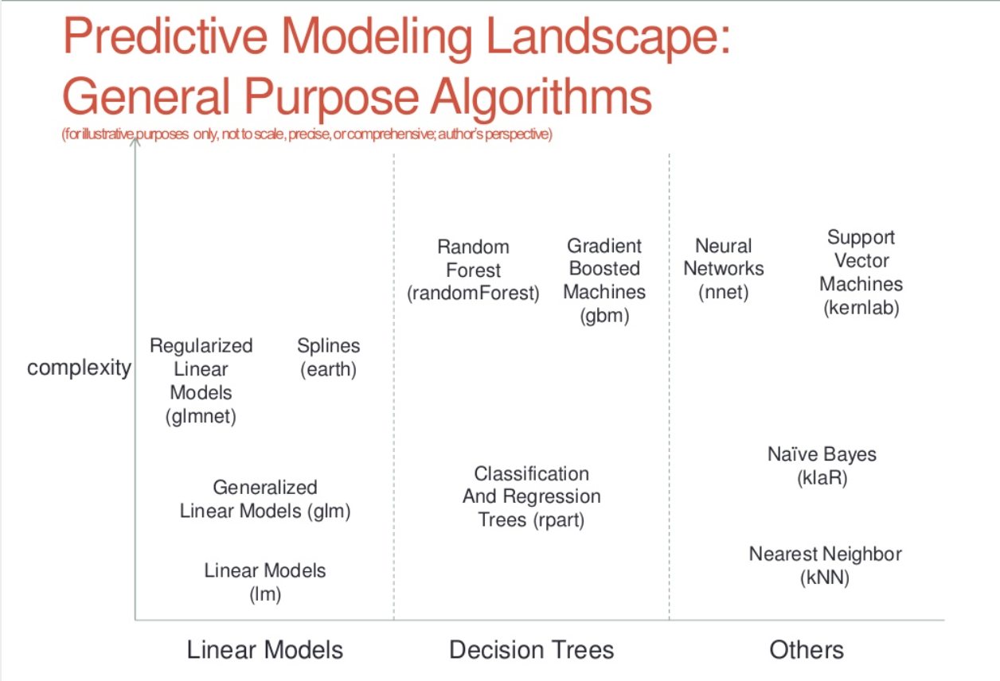

This is a writeup for the coursera's machine learning class final project. In this writeup I have applied the machine learning algo's to the case provided and submitted the results.

# Background

Using devices such as Jawbone Up, Nike FuelBand, and Fitbit it is now possible to collect a large amount of data about personal activity relatively inexpensively. These type of devices are part of the quantified self movement - a group of enthusiasts who take measurements about themselves regularly to improve their health, to find patterns in their behavior, or because they are tech geeks. One thing that people regularly do is quantify how much of a particular activity they do, but they rarely quantify how well they do it. In this project, your goal will be to use data from accelerometers on the belt, forearm, arm, and dumbell of 6 participants. They were asked to perform barbell lifts correctly and incorrectly in 5 different ways. More information is available from the website here: http://groupware.les.inf.puc-rio.br/har (see the section on the Weight Lifting Exercise Dataset).

## Data

The training data for this project are available here:
https://d396qusza40orc.cloudfront.net/predmachlearn/pml-training.csv

The test data are available here:
https://d396qusza40orc.cloudfront.net/predmachlearn/pml-testing.csv

# Setup
Let us first get the data and get it into a shape from which we would apply the various Machine Learning algos.

Get the required libraries loaded
```{r}
library(caret)

library(xgboost)
library(Matrix)
library(methods)
library(randomForest)
library(rpart)
library(rattle)
```

## Get the data

Let us first get the training and test set
```{r}

set.seed(486)

trainSet <- read.csv(url("https://d396qusza40orc.cloudfront.net/predmachlearn/pml-training.csv"))
testSet <- read.csv(url("https://d396qusza40orc.cloudfront.net/predmachlearn/pml-testing.csv"))

```

Then we will combine both so that we can do all cleansing activities once, then we would separate them again.

First make the columns same in both the sets
```{r}
savedOutcome <- trainSet$classe
trainSet <- subset(trainSet,select = -c(classe))
problemIDs <- testSet$problem_id
testSet <- subset(testSet, select = -c(problem_id))
```

Now we merge them
```{r}
trainSet$X <- -(1:nrow(trainSet))
dataSet <- rbind(trainSet,testSet)
```

## Data Cleansing
We would apply some data cleansing activites like 
1. Getting rid of Near Zero Variance Predictors
2. Clean variables with too many categories
3. Clean NA values

### Near Zero Variance Predictors
```{r}
dataSet <- dataSet[,-nearZeroVar(dataSet)]
dim(dataSet)
```

### Too many categories
```{r}
for(i in 1:ncol(dataSet)){
  if(!is.numeric(dataSet[,i])){
    freq = data.frame(table(dataSet[,i]))
    freq = freq[order(freq$Freq, decreasing = TRUE),]
    dataSet[,i] = as.character(match(dataSet[,i], freq$Var1[1:30]))
    dataSet[is.na(dataSet[,i]),i] = "rareValue"
    dataSet[,i] = as.factor(dataSet[,i])
  }
}
```

### NA Values
```{r}
for(i in 1:ncol(dataSet)){
  if(is.numeric(dataSet[,i])){
    dataSet[is.na(dataSet[,i]),i] = -1
  }else{
    dataSet[,i] = as.character(dataSet[,i])
    dataSet[is.na(dataSet[,i]),i] = "NAvalue"
    dataSet[,i] = as.factor(dataSet[,i])
  }
}
```

## Separate the dataSets
The tr and te values have been changed to catego
```{r}
trainSet <- dataSet[which(dataSet$X < 0),]
testSet <- dataSet[which(dataSet$X > 0),]
dim(trainSet)
dim(testSet)
```

# Apply the Machine Learning
This is a classification problem and decision tree based aglorithms are most common machine learning algo we apply in this case, see the Predictive Modeling Landscape below



We would now use all the decision based tree algo's listed above.

## Preprocess 
Lets first preprocess the data.

```{r}
train.pca <- preProcess(trainSet[,-c(2,5)])
trainPC <- predict(train.pca,trainSet[,-c(2,5)])
trainPC$classe <- savedOutcome
dim(trainPC)
```

Now split the training set into train and probe set to check the algo performance. We keep 60% data in train set and rest in probe set.

```{r}
inTrain <- createDataPartition(savedOutcome, p=0.6)
DTrain <- trainPC[inTrain[[1]],]
DProbe <- trainPC[-inTrain[[1]],]
```

## Random Forest
Let's first try random forest one of the most popular tree based machine learning algo's.

```{r}
modelRF <- randomForest(classe~.,DTrain,ntree=100)
```

Now lets get the predictions
```{r}
predRF <- predict(modelRF, DProbe)
```

Finally check the results
```{r}
confusionMatrix(predRF, DProbe$classe)
```


## Recursive Partitioning and Regression Trees
Let's now try rpart

```{r}
modelRP <- rpart(classe~.,DTrain,method="class")
predRP <- predict(modelRP, DProbe,type = "class")
confusionMatrix(predRP, DProbe$classe)
fancyRpartPlot(modelRP)
```

## Gradient Boosting Machines
Now we would try xgBoost - Extreme Gradient Boosting, one of the most used Gradient Boosting algo's these days in competitions like Kaggle.

To apply this algo first we need to construct sparse martix form the data
```{r}
tr.mf  <- model.frame(as.formula(paste("classe ~",paste(names(DTrain),collapse = "+"))),DTrain)
tr.m  <- model.matrix(attr(tr.mf,"terms"),data = DTrain)
tr  <- Matrix(tr.m,sparse=TRUE)

tp.mf <- model.frame(as.formula(paste("classe ~",paste(names(DProbe),collapse = "+"))),DProbe)
tp.m <- model.matrix(attr(tp.mf,"terms"),data = DProbe)
tp  <- Matrix(tp.m,sparse=TRUE)

freq = data.frame(table(DTrain[,"classe"]))
DTrain[,"classe"] = as.numeric(match(DTrain[,"classe"], freq$Var1[1:30]))-1

tr.x  <- xgb.DMatrix(tr,label = DTrain$classe)
tp.x  <- xgb.DMatrix(tp)
```

Now we would define the parameters to run this algo
```{r}
par  <-  list(booster = "gbtree",
              objective = "multi:softmax",
              eta = 0.1,
              min_child_weight = 1,
              gamma = 1,
              subsample = 0.50,
              colsample_bytree = 0.90,
              max_depth = 10,
              verbose = 1,
              num_class = 5,
              scale_pos_weight = 1)
              
n_rounds= 500
```

Now lets run it and generate the prediction and see its results
```{r}
model.xgb  <- xgb.train(par,tr.x,n_rounds)
pred.xgb <- predict(model.xgb,tp.x)
predCat.xgb <- ifelse(pred.xgb == 0,'A', 
               ifelse(pred.xgb == 1,'B',
               ifelse(pred.xgb == 2,'C',
               ifelse(pred.xgb == 3,'D','E'))))

confusionMatrix(predCat.xgb, DProbe$classe)
```

## Final Test Data
All the three algo's are  pretty close in terms of accuracy. So I plan to apply Random Forest on the test data and produce the results

```{r}
testPC <- predict(train.pca,testSet[,-c(2,5)])
test.pred <- predict(modelRF, testPC)
```

Create the files for submissions
```{r}
submission_files = function(x){
  n = length(x)
  for(i in 1:n){
    filename = paste0("problem_id_",i,".txt")
    write.table(x[i],file=filename,quote=FALSE,row.names=FALSE,col.names=FALSE)
  }
}

submission_files(test.pred)
```
